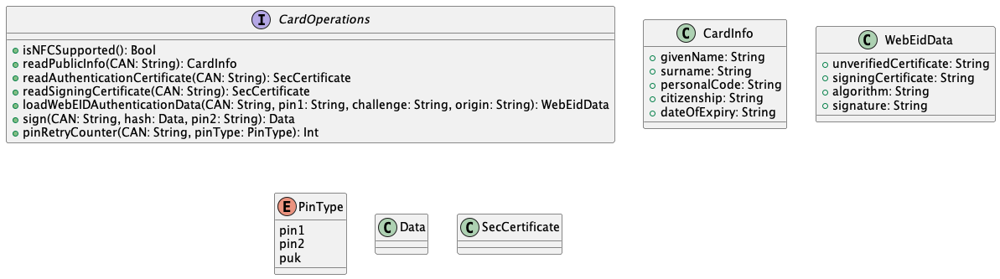
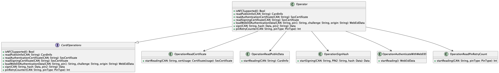

# iOS NFC-ID teek - arhitektuuridokument
## Ülevaade
iOS NFC pakub võimalust teha ID-kaardiga erinevaid operatsioone. Eesmärk on lihtsustada ID-kaardiga suhtlust läbi protokollide implementatsiooni. Sedasi jääb lõpptarbija ülesandeks vaid teegiga liidestamine. Toetatud operatsioonide loetelu on välja toodud Androidi arhitektuuri dokumendi alamjaotuses [Arhitektuurselt olulised nõudmised](https://github.com/e-gov/eid-nfc-Android-lib/blob/main/doc/arhitektuur.md#arhitektuurselt-olulised-n%C3%B5udmised).

## Teegi ülesehitus
Teek kasutab ID-kaardiga suhtlemiseks iOS poolt pakutavat [NFC](https://developer.apple.com/documentation/corenfc) võimekust. Arhitektuuri osas on eesmärgiks võetud teegi võimalikult lihtne, mugav ja üldine kasutus, s.t teegi loomisel ei ole lähtutud olemasolevate rakenduste abstraktsioonidest ja kasutuslugudest. Seatud eesmärgist tulenevalt on loodud üldine API liides.

SDK avalik liides on defineeritud CardOperations failis.

Pakutav funktsionaalsus on implementeeritud Operator klassis. Operator kasutab selle jaoks täiendavaid klasse, mis teostavad ID-kaardiga suhtluse üle NFC kanali. Antud struktuur on näidatud alloleval joonisel.

## Otsused
iOS teegi puhul tehtud otsused on valdavalt samad, mis Androidil. Peamine erisus on teegi ülesehituses. iOS arhitektuur ei põhine MOPP abstratsioonidel erinevalt Androidist.
Ülejäänud otsuste kohta on informatsioon leitav järgnevatest Androidi alamjaotustest
- [Skoop](https://github.com/e-gov/eid-nfc-Android-lib/blob/main/doc/arhitektuur.md#skoop)
- [Lahtiütlused](https://github.com/e-gov/eid-nfc-Android-lib/blob/main/doc/arhitektuur.md#lahti%C3%BCtlused)
- [Autentimine](https://github.com/e-gov/eid-nfc-Android-lib/blob/main/doc/arhitektuur.md#autentimine-1)